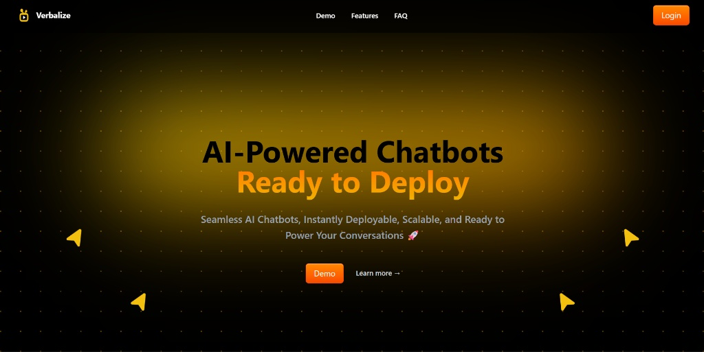

<div align="center">

# Verbalize



### 🤖 AI-Powered Chatbots, Ready to Deploy

A Chatbot-as-a-Service platform that allows users to create, deploy, and embed AI-powered chatbots on any website.

[](https://verbalize.mrinank-ai.tech/)
[](https://opensource.org/licenses/MIT)
[](https://github.com/Mrinank-Bhowmick)

</div>

---

## 🎯 Features

| Feature                    | Description                                                      |
| -------------------------- | ---------------------------------------------------------------- |
| 🎨 **Custom Chatbots**     | Create and customize AI chatbots with custom system instructions |
| 🚀 **One-Click Deploy**    | Deploy chatbots with a single click                              |
| 📦 **Easy Embedding**      | Embed chatbots on any website using a simple iframe code         |
| ⚡ **Real-time Streaming** | AI streaming responses powered by Google Gemini                  |
| 🔐 **Secure Auth**         | User authentication with Clerk                                   |
| 📊 **Dashboard**           | Manage multiple chatbots from a centralized dashboard            |

---

## 🛠️ Tech Stack

<div align="center">

### Frontend


### Backend


</div>

---

## 📖 Usage

1. **Sign up** and create an account
2. Navigate to the **Agents Arena**
3. **Create** a new chatbot agent
4. **Configure** the chatbot settings:
   - 📝 Name
   - 📄 Description
   - 💬 First message
   - ⚙️ System instructions (optional)
5. Click **"Deploy"** to make the chatbot live
6. **Copy** the embed code and paste it into your website

---

## 🔗 Embedding the Chatbot

After deploying a chatbot, you'll receive an iframe embed code:

```html
<!-- Verbalize Chatbot Embed Code -->
<iframe
  id="verbalize-chatbot-mrinank-1761511071866"
  src="https://verbalize.mrinank-ai.tech/chatbot?agentId=[your_agent_id]&clientId=[your_client_id]"
  style="position: fixed; bottom: 20px; right: 20px; width: 400px; height: 500px; border: none; z-index: 9999;"
  allow="clipboard-read; clipboard-write"
  sandbox="allow-scripts allow-same-origin allow-forms allow-popups allow-popups-to-escape-sandbox"
></iframe>
```

> 💡 **Tip:** Paste this code before the closing `</body>` tag in your HTML.

---

## 📄 License

This project is licensed under the **MIT License**.

---

<div align="center">

### 👨‍💻 Author

**Mrinank Bhowmick**

[](https://github.com/Mrinank-Bhowmick)

---

⭐ **Star this repo if you find it helpful!** ⭐

</div>
